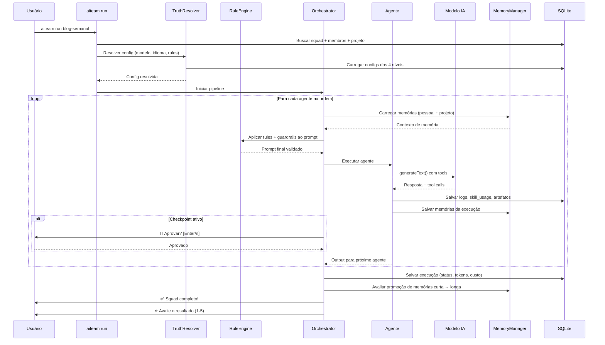

# AITeam — Arquitetura Técnica

**Versão:** 1.0
**Data:** 2026-05-16

---

## 1. Stack Tecnológica

| Camada | Tecnologia | Versão | Justificativa |
|--------|-----------|--------|---------------|
| **Linguagem** | TypeScript | 5.x | Type-safety, DX, ecossistema npm |
| **Runtime** | Node.js | 20+ LTS | Compatibilidade, performance |
| **Build** | tsup | 8.x | Build rápido, ESM + CJS |
| **Testes** | Vitest | 3.x | Compatível com TypeScript nativo |
| **CLI** | commander | 13.x | Padrão de mercado, robusto |
| **Prompts** | @inquirer/prompts | 7.x | Interativo, bonito, extensível |
| **Banco** | better-sqlite3 | 11.x | Síncrono, rápido, zero config |
| **RAG (Fase 3)** | sqlite-vec | - | Busca vetorial dentro do SQLite |
| **LLM** | ai (Vercel AI SDK) | 6.x | Multi-provider, streaming, tools |
| **LLM Google** | @ai-sdk/google | - | Gemini 3 Flash/Pro |
| **LLM Anthropic** | @ai-sdk/anthropic | - | Claude Sonnet/Opus |
| **LLM OpenAI** | @ai-sdk/openai | - | GPT-4o |
| **LLM Local** | ai-sdk-ollama | - | Ollama (local) |
| **Crypto** | node:crypto (nativo) | - | Vault AES-256-GCM |
| **Painel (F2)** | Fastify + React + Vite | - | Leve, rápido |
| **Terminal (F2)** | xterm.js + node-pty | - | Terminal real no browser |
| **Explorer (F2)** | react-arborist | - | File tree com virtualização |
| **WebSocket (F2)** | @fastify/websocket | - | Real-time, heartbeat |

---

## 2. Estrutura de Pastas do Projeto

```
aiteam/                              ← Raiz do repositório
├── .agent/
│   ├── specs/                       ← Documentação técnica
│   │   ├── prd.md
│   │   ├── arquitetura.md
│   │   └── seguranca.md
│   └── planning.md
├── .github/
│   ├── FUNDING.yml
│   ├── workflows/
│   │   ├── ci.yml
│   │   └── publish.yml
│   └── ISSUE_TEMPLATE/
├── src/
│   ├── index.ts                     ← Entry point CLI
│   ├── cli/
│   │   ├── index.ts                 ← Registro de comandos (commander)
│   │   ├── commands/
│   │   │   ├── init.ts
│   │   │   ├── config.ts
│   │   │   ├── company.ts
│   │   │   ├── agent.ts
│   │   │   ├── squad.ts
│   │   │   ├── run.ts
│   │   │   ├── rule.ts
│   │   │   ├── guardrail.ts
│   │   │   ├── vault.ts
│   │   │   ├── knowledge.ts
│   │   │   ├── memory.ts
│   │   │   ├── style.ts
│   │   │   ├── logs.ts
│   │   │   ├── errors.ts
│   │   │   ├── status.ts
│   │   │   ├── panel.ts
│   │   │   └── update.ts
│   │   └── ui/                      ← Helpers de formatação CLI
│   │       ├── spinner.ts
│   │       ├── table.ts
│   │       └── colors.ts
│   ├── core/
│   │   ├── orchestrator.ts          ← Motor de execução de pipelines
│   │   ├── truth-resolver.ts        ← Fonte da verdade hierárquica
│   │   ├── memory-manager.ts        ← Gerencia 3 camadas de memória
│   │   ├── rule-engine.ts           ← Aplica rules + guardrails
│   │   └── cost-tracker.ts          ← Rastreamento de custos
│   ├── db/
│   │   ├── index.ts                 ← Conexão + migrations
│   │   ├── schema.ts                ← DDL completo
│   │   ├── repositories/
│   │   │   ├── projects.ts
│   │   │   ├── agents.ts
│   │   │   ├── squads.ts
│   │   │   ├── memories.ts
│   │   │   ├── rules.ts
│   │   │   ├── vault.ts
│   │   │   ├── knowledge.ts
│   │   │   ├── logs.ts
│   │   │   ├── errors.ts
│   │   │   ├── ratings.ts
│   │   │   ├── examples.ts
│   │   │   ├── styles.ts
│   │   │   └── artifacts.ts
│   │   └── migrations/
│   │       └── 001_initial.ts
│   ├── llm/
│   │   ├── index.ts                 ← Factory de providers
│   │   ├── models.ts                ← Catálogo de modelos
│   │   └── providers/
│   │       ├── google.ts
│   │       ├── anthropic.ts
│   │       ├── openai.ts
│   │       └── ollama.ts
│   ├── tools/
│   │   ├── index.ts                 ← Registry de tools
│   │   ├── file-read.ts
│   │   ├── file-write.ts
│   │   └── shell-exec.ts
│   ├── i18n/
│   │   ├── index.ts                 ← loadLocale(), t()
│   │   ├── types.ts
│   │   └── locales/
│   │       ├── pt-BR.json
│   │       ├── en.json
│   │       └── es.json
│   ├── templates/
│   │   ├── ide/
│   │   │   ├── antigravity/
│   │   │   ├── claude-code/
│   │   │   ├── cursor/
│   │   │   ├── vscode-copilot/
│   │   │   ├── codex/
│   │   │   ├── gemini-cli/
│   │   │   ├── opencode/
│   │   │   ├── qwen-code/
│   │   │   └── trae/
│   │   └── defaults/
│   │       ├── company.md
│   │       └── config.yaml
│   └── vault/
│       ├── index.ts                 ← Encrypt/decrypt
│       └── crypto.ts                ← AES-256-GCM helpers
├── tests/
│   ├── db/
│   ├── core/
│   ├── cli/
│   └── tools/
├── package.json
├── tsconfig.json
├── tsup.config.ts
├── vitest.config.ts
├── LICENSE                          ← MIT
├── README.md
├── CONTRIBUTING.md
└── CHANGELOG.md
```

---

## 3. Modelo ER Completo

```mermaid
erDiagram
    PROJECTS ||--o{ PROJECT_SQUADS : "usa"
    PROJECTS ||--o{ PROJECT_AGENTS : "acessa"
    PROJECTS ||--o{ EXECUTIONS : "executa em"
    PROJECTS ||--o{ MEMORIES : "contém"
    PROJECTS ||--o{ RULES : "define"
    PROJECTS ||--o{ KNOWLEDGE : "armazena"
    
    AGENTS ||--o{ SQUAD_MEMBERS : "participa de"
    AGENTS ||--o{ PROJECT_AGENTS : "atua em"
    AGENTS ||--o{ MEMORIES : "possui"
    
    SQUADS ||--o{ SQUAD_MEMBERS : "contém"
    SQUADS ||--o{ PROJECT_SQUADS : "alocado em"
    SQUADS ||--o{ EXECUTIONS : "executado por"
    
    EXECUTIONS ||--o{ EXECUTION_STEPS : "composto de"
    EXECUTIONS ||--o{ AGENT_INTERACTIONS : "registra"
    EXECUTIONS ||--o{ SKILL_USAGE_LOGS : "rastreia"
    EXECUTIONS ||--o{ ARTIFACTS : "produz"
    
    PROJECTS {
        text id PK
        text name
        text path
        text language
        text user_name
        text default_model
        text ides
        text company_context_path
    }
    
    AGENTS {
        text id PK
        text name UK
        text role
        text system_prompt
        text model
        real temperature
        int max_tokens
        text personality
    }
    
    SQUADS {
        text id PK
        text name UK
        text description
        text pipeline
    }
    
    SQUAD_MEMBERS {
        text squad_id PK_FK
        text agent_id PK_FK
        int position
        text role_in_squad
        int checkpoint
    }
    
    PROJECT_SQUADS {
        text project_id PK_FK
        text squad_id PK_FK
        text config_overrides
        int enabled
    }
    
    PROJECT_AGENTS {
        text project_id PK_FK
        text agent_id PK_FK
        text config_overrides
    }
    
    EXECUTIONS {
        text id PK
        text project_id FK
        text squad_id FK
        text status
        int total_tokens
        real total_cost_usd
        int duration_ms
    }
    
    EXECUTION_STEPS {
        text id PK
        text execution_id FK
        text agent_id FK
        int step_number
        text input_summary
        text output_summary
        text status
        int tokens_used
    }
    
    MEMORIES {
        text id PK
        text owner_type
        text owner_id
        text layer
        text project_id
        text category
        text content
        int is_abstract
        real relevance_score
    }
    
    RULES {
        text id PK
        text project_id
        text name
        text type
        text scope
        int priority
        int enabled
    }
    
    GUARDRAILS {
        text id PK
        text project_id
        text name
        text type
        text config
        text action
    }
    
    VAULT {
        text id PK
        text project_id
        text name
        text category
        blob encrypted_value
        blob iv
    }
    
    KNOWLEDGE {
        text id PK
        text project_id
        text category
        text title
        text content
        text source_url
        text tags
    }
    
    RATINGS {
        text id PK
        text project_id
        text target_type
        text target_id
        int score
        text feedback
    }
    
    SKILL_USAGE_LOGS {
        text id PK
        text project_id
        text execution_id FK
        text agent_id
        text skill_id
        int success
        int duration_ms
    }
    
    ERROR_LOGS {
        text id PK
        text project_id
        text agent_id
        text skill_id
        text error_type
        text message
        int resolved
    }
    
    ARTIFACTS {
        text id PK
        text project_id
        text execution_id FK
        text name
        text type
        text file_path
    }
    
    EXAMPLES {
        text id PK
        text project_id
        text type
        text title
        text content
        text correction
    }
    
    STYLES {
        text id PK
        text project_id
        text name
        text content
        text type
    }
    
    AGENT_INTERACTIONS {
        text id PK
        text execution_id FK
        text from_agent_id
        text to_agent_id
        text type
        text message
    }
    
    TRUTH_CONFIG {
        text id PK
        text scope_type
        text scope_id
        text key
        text value
    }
    
    API_KEYS {
        text provider PK
        text api_key
    }
```



---

## 4. Fluxo de Execução de um Squad



---

## 5. Estrutura Local — Global vs Projeto

```
GLOBAL (~/.aiteam/)
├── config.yaml              ← API keys, preferências globais
├── aiteam.db                ← Banco SQLite central
├── vault.enc                ← Vault global criptografado
└── cache/                   ← Cache de embeddings, etc.

PROJETO (d:\projetos\meu-projeto\)
├── .aiteam/
│   ├── config.yaml          ← Overrides locais
│   ├── company.md           ← Contexto da empresa
│   ├── vault.enc            ← Vault do projeto
│   └── output/              ← Saída dos agentes
├── (arquivos do projeto)
└── (IDE configs geradas pelo init)
```

---

## 6. Segurança (Resumo)

| Ameaça | Mitigação |
|--------|-----------|
| Path traversal no File Explorer | `resolveSafePath()` sandbox |
| Vazamento de API keys | Vault AES-256-GCM, mascaramento em logs |
| Injeção de prompt | Guardrails com content filter |
| Cross-project data leak | Memória abstrata, isolamento por project_id |
| Execução de shell malicioso | Tool shell_exec com whitelist configurável |
| Dependências vulneráveis | CI com `npm audit`, Dependabot |
